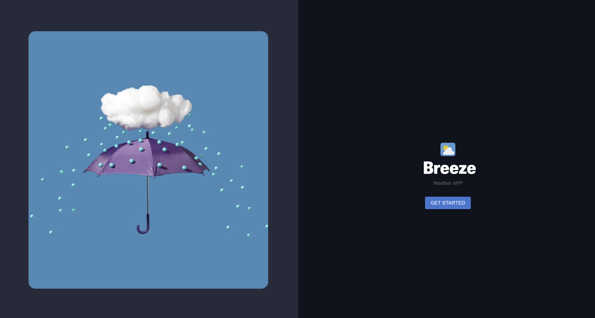
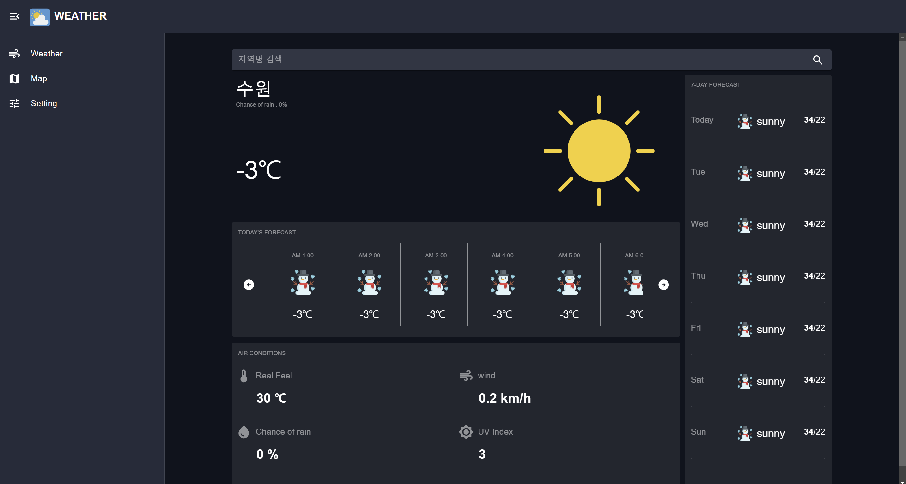
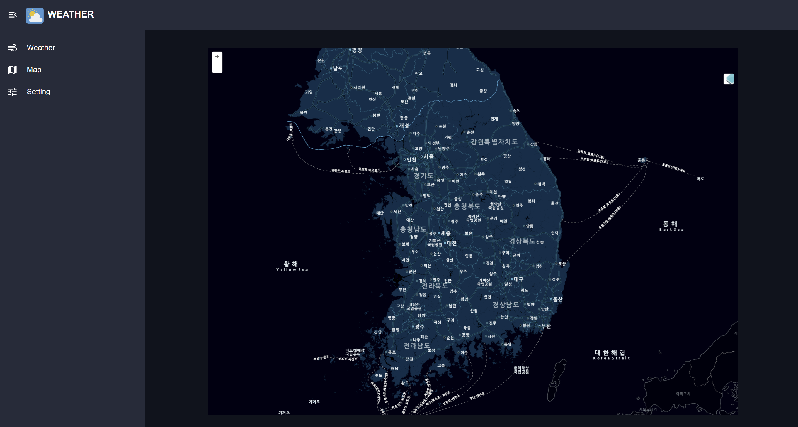
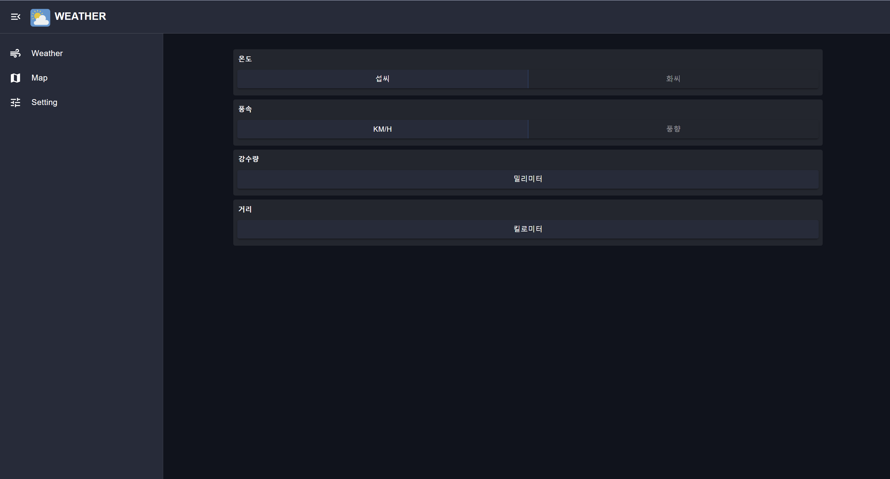

# MiniProject (Weather Dashboard)

### 프로젝트 다운로드
```
$ yarn install
$ yarn dev
```

### 프로젝트 빌드
```
$ yarn build
```

### 사용 UI Tool 및 상태관리 라이브러리
>* MUI
>* React-Query (서버관리)
>* Redux-Toolkit (상태관리) 


* * *

## 화면 구성

### Main
- GetStart Button 을 클릭 시, 대시보드로 이동한다.



### Dashboard
- 대시보드 이동 시 지역 별 날씨를 확인 할 수 있으며 , 시간 별 날짜 별 표출을 한다. 
- 오늘의 날씨 와 기상 데이터들을 확인 가능하다.




### Map
- 사용자는 표시 된 지도 아이콘을 클릭 시, 단순 말풍선으로 표출 된 UI로 날씨 기상 데이터를 확인 가능하다.




### Setting
- 온도(섭씨, 화씨), 풍향(풍속) 를 선택하여 확인 할 수 있다.

